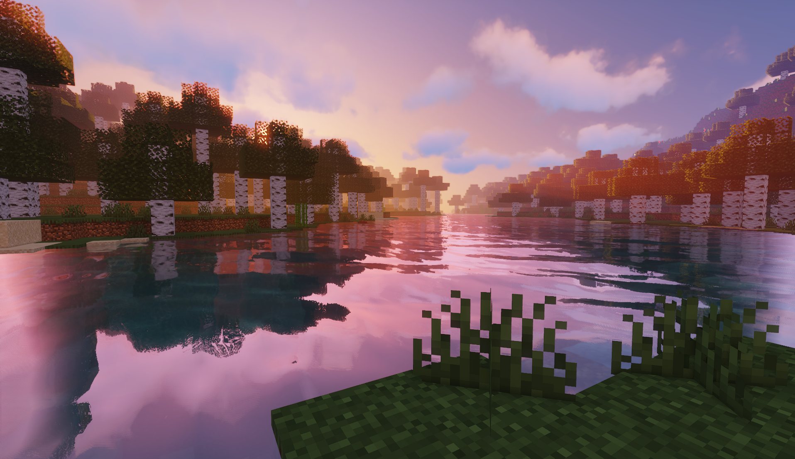

# Minecraft Server Portal Template

A universal, customizable web portal template for Minecraft (or other games) servers.  
Built with pure **HTML, CSS, and JavaScript** — no backend required.



---

## ✨ Features
- Fully configurable via `admin.html` (auto-generates `config.json`)
- Dynamic content: server info, rules, FAQ, staff list, and news
- 2×2 grid layout with responsive design
- Customizable background (image or video)
- Adjustable fonts and brightness settings
- Works seamlessly on **GitHub Pages** or any static hosting

---

## 🚀 How to use
1. Open `admin.html` locally to set up your server info and design.
2. Click **Apply (Preview)** to test instantly.
3. Click **Export config.json** to generate your configuration file.
4. Place `config.json` next to `index.html`.
5. Deploy everything to your hosting or **GitHub Pages**.

---

## 🧩 Recommended Use
You can easily re-theme this portal for any other game by adjusting:
- Background visuals (use your own screenshots)
- Color palette and font set (via admin)
- Section titles and labels (edit `index.html`)

---

## 📜 License
MIT License © 2025 Tomáš  

_This project is not affiliated with Mojang or Microsoft. Minecraft™ is a trademark of Mojang AB._

---

## 🌐 Live Demo
*(To be added after publishing on GitHub Pages)*  
Example URL:  
```
https://tomasakl.github.io/minecraft-server-portal-template/
```

---

**Author:** Tomáš  
**Version:** 1.0 – 2025  
